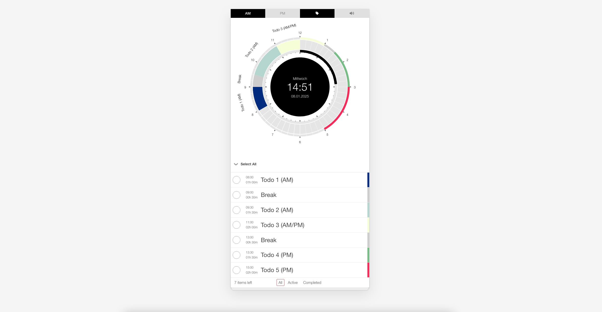

# TodoClock

An interactive dial-based to-do list application, that combines task management with an interactive clock, allowing users to organize and track their tasks visually within specific time ranges.

This project was generated using [Angular CLI](https://github.com/angular/angular-cli) version 19.0.6.

## Description

TodoClock is an interactive application that combines time management with task tracking. Using a visual clock interface, you can manage and track your to-dos within specific time ranges. Create, edit, and categorize tasks, mark them as completed, and track your progress. With customizable features such as AM/PM toggling, tag visibility, and sound notifications, it offers an intuitive way to stay organized and productive.

## Screenshot



## Features

- **Interactive Clock**: View the current time and date, and mark time ranges to add to-dos.
- **Create To-Dos**: Add to-dos by dragging on the clock and setting a title and a color.
- **Edit To-Dos**: Double-click on a list item to edit its title.
- **Delete To-Dos**: Click the delete icon to remove to-dos from the list.
- **Mark To-Dos as Completed**: Mark tasks as completed, which visually grays out the task both in the list and on the clock.
- **Switch Between AM/PM**: Toggle between AM and PM, bringing relevant to-dos for the selected period to the foreground.
- **Toggle Tags Visibility**: Show or hide to-do tags in the chart for a cleaner or more detailed view.
- **Acoustic Notifications**: Enable sound notifications that remind you when an hour has passed, helping you stay on track.

## Installation

Step-by-step instructions for installing and running the project locally:

```bash
# Clone the repository
git clone https://github.com/nbarge/TodoClock.git

# Navigate to the project directory
cd TodoClock

# Install dependencies
npm install

# Start the application
ng serve
```

## Usage

This application features an interactive clock where you can manage your to-dos visually:

1. **View Time and Date**: The clock displays the current time and date on a sleek, minimal interface.
2. **Select a Time Range**: Click and drag on the outer circle of the clock to select a time range for your to-do.
3. **Add a To-Do**: After releasing the drag (mouseup), a modal window appears:
   - Enter a title for your to-do.
   - Choose a color to categorize or prioritize the task.
   - Submit the form to add the to-do to the list.
4. **Edit a To-Do**: Double-click on any list item to modify the title.
5. **Delete a To-Do**: To remove a to-do, click the delete icon located on the right side of the list item.
6. **Mark a To-Do as Completed**: Mark a task as completed by clicking the checkbox. The to-do will:
   - Appear crossed out in the list.
   - The corresponding time range on the clock will be grayed out, visually indicating the task is finished.
7. **Switch Between AM and PM**: Toggle between AM and PM periods in the header. When switching:
   - The to-dos for the selected time period will be visually brought to the foreground, making it easier to focus on tasks relevant to the current time of day.
8. **Toggle Tags Visibility in the Chart**: You can show or hide the task tags in the chart. This allows you to either focus on a cleaner view or have a more detailed overview of your tasks.
9. **Enable/Disable Acoustic Notifications**: You can activate or deactivate sound notifications. When enabled, the app will remind you every time an hour has passed with a brief sound cue, helping you stay on track with your tasks.

## Contributing

Contributions are welcome! Please open an issue or submit a pull request with any changes or improvements.

## License

This repo is licensed under the MIT License.  

The majority of the code in this repository was written by Nils Barge.  
It includes portions of code from the TodoMVC Project (https://github.com/tastejs/todomvc),  
MIT © Addy Osmani, Sindre Sorhus, Pascal Hartig, Stephen Sawchuk.  

See the [LICENSE](./LICENSE) file for details.

## Acknowledgements

- This project uses [D3.js](https://d3js.org/), a powerful library for creating dynamic, interactive data visualizations in web browsers. © Mike Bostock and contributors.
- Thanks to the D3.js community and contributors for maintaining this incredible library and providing extensive documentation and examples.
- Portions of this project were adapted from the [TodoMVC Project](https://github.com/tastejs/todomvc), © Addy Osmani, Sindre Sorhus, Pascal Hartig, Stephen Sawchuk.